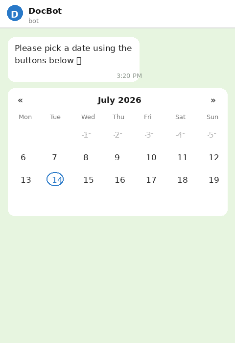
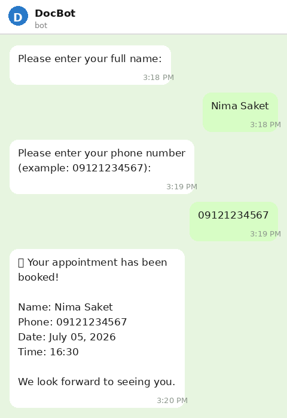

<p align="center">
  
</p>

<h1 align="center">🦷 Dentis Bot</h1>

<p align="center">
  ربات تلگرامی رزرو نوبت برای مطب دندان‌پزشکی — ساخته‌شده با aiogram 3.x
</p>

---

## ✨ ویژگی‌ها

- 📋 فرآیند رزرو مرحله‌به‌مرحله: نام → شماره تماس → تاریخ → ساعت
- 📅 تقویم تعاملی با دکمه (شمسی برای فارسی، میلادی برای انگلیسی)
- ⏰ ساعت‌های عرف مطب (صبح و عصر)، با بلاک‌شدن خودکار ساعت‌ها و روزهای پر
- 🌐 دوزبانه: فارسی و English، هرکس زبان خودش رو انتخاب می‌کنه
- ❌ لغو/حذف نوبت توسط خود مشتری (`/cancel`)
- 👨‍⚕️ پنل ادمین برای دیدن لیست نوبت‌ها (`/appointments`)
- 🔒 توکن و اطلاعات حساس همیشه در `.env`، هیچ‌وقت داخل کد

## 📸 تصاویر

<p align="center">
  
  
</p>

## 🛠 تکنولوژی‌ها

- Python 3.10+
- [aiogram 3.x](https://docs.aiogram.dev/) — فریم‌ورک بات تلگرام
- SQLite — ذخیره‌ی نوبت‌ها
- `jdatetime` — تبدیل و کار با تاریخ شمسی

## 🚀 راه‌اندازی

```bash
git clone https://github.com/nima199x/dentis_bot.git
cd dentis_bot

python -m venv dentis_venv
# ویندوز:
.\dentis_venv\Scripts\Activate.ps1
# لینوکس/مک:
source dentis_venv/bin/activate

pip install -r requirements.txt
```

یه فایل `.env` بساز (از روی `.env.example` کپی کن) و مقادیر واقعی رو بذار:

```
BOT_TOKEN=your_bot_token_here
PROXY_URL=http://127.0.0.1:10808
ADMIN_IDS=your_numeric_telegram_id
```

اجرا:

```bash
python bot.py
```

## 📂 ساختار پروژه

```
dentis_bot/
├── bot.py            # نقطه‌ی ورود و راه‌اندازی بات
├── config.py         # خوندن تنظیمات از .env
├── database.py       # مدیریت دیتابیس SQLite
├── handlers.py       # منطق FSM و دستورات بات
├── calendar_kb.py     # ساخت تقویم شمسی/میلادی
├── time_kb.py         # ساخت کیبورد ساعت‌های نوبت
├── lang.py            # متن‌های فارسی/انگلیسی
└── requirements.txt
```

## 📄 لایسنس

فقط برای استفاده‌ی شخصی/داخلی. بدون لایسنس رسمی.
